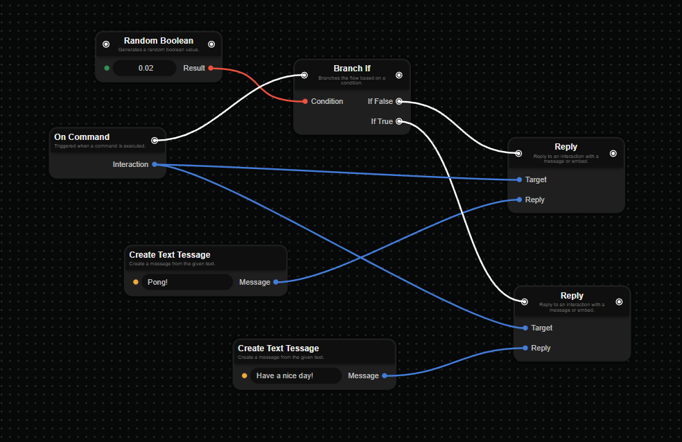

<h1 align="center">DISBOTTER </h1>
<p align="center">
    Open-source web editor for Discord bots!
</p>

<p align="center">
    
</p>

## About

I made this project because I wanted to create a web node editor, and I thought it would be cool to make it for Discord bots. I also wanted to make it open-source so that people could contribute to it and make it better.

Currently the project is in a very early stage, and I'm still working on it. I'm planning to add more features and make it better in the future.

## How to use?

As currently the project is in a very early stage, I haven't deployed it yet. You can run it locally by following the steps below.

### Prerequisites

- [Node.js](https://nodejs.org/en/)
- [Rust](https://www.rust-lang.org/tools/install)

### Usage

1. Clone the repository

```sh
git clone https://github.com/olix3001/disbotter-web
```

2. Install the dependencies

```sh
npm install
```

3. Run web editor

```sh
pnpm dev
# or
npm run dev
```

**Note**: You can skip steps 2-3 if you are using the web editor from https://disbotter.olix3001.xyz. (I recommend using the web editor from the website as it is automatically updated and has builtin error reporting).

4. Work on the project, add some commands and etc.
5. Save the project

6. Create new disbotter project from https://github.com/olix3001/disbotter-example-project

7. Go to the `disbotter-generator` directory

```sh
cd disbotter-generator
```

8. Use the `compile` command to compile the project. As path for the output, use the `src` directory of the disbotter project you created in step 6.

```sh
cargo run -- compile --path <path/to/dbp/file> --output <path/to/src/directory> --nodes ../data/nodes
```

9. Run the disbotter project (In disbotter-example-project directory)

```sh
pnpm start
# or
npm start
```

## Notes

I know that the process is a bit complicated, but I'm planning to make it easier in the future as it is meant to be a full web editor.

## Contributing

If you want to contribute to the project, you can do so by creating a pull request. I will review it and if it's good, I will merge it.
Also, if you have any suggestions, ideas or you found a bug, you can create an issue.
