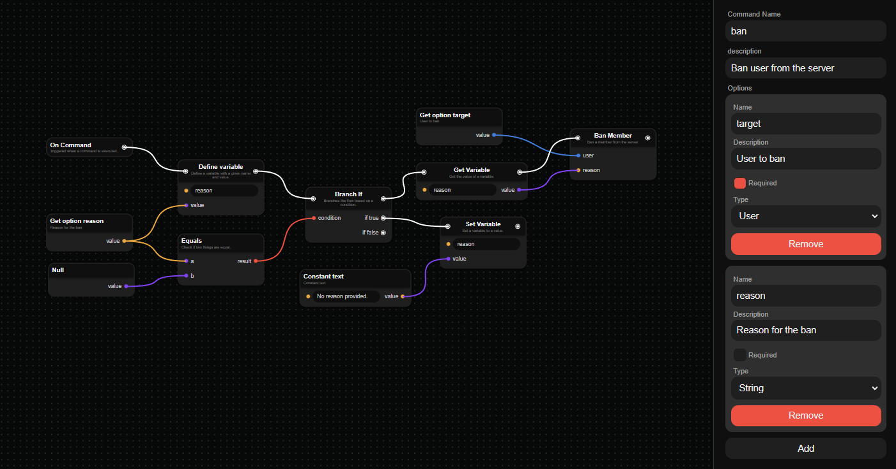

<h1 align="center">DISBOTTER </h1>

    Open-source web editor for Discord bots!

    

## About

I made this project because I wanted to create a web node editor, and I thought it would be cool to make it for Discord bots. I also wanted to make it open-source so that people could contribute to it and make it better.

Currently the project is in a very early stage, and I'm still working on it. I'm planning to add more features and make it better in the future.

## Features

- [x] Node editor
- [x] Save/load projects
- [x] Generate code from nodes
- [ ] Connect to backend to automatically generate code

## How to use (for now)

To generate code from the nodes, you need to save the project and then modify disbotter-generator source code to use the saved project.

This is temporary, there will be a backend in the future that will automatically generate code from the nodes and CLI tools to compile the code.
